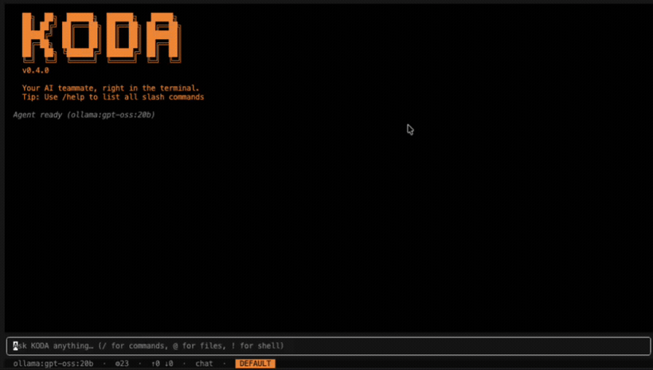

<div align="center">

# KODA — Coding Agent

**An AI coding agent that lives in your terminal.**

Long‑horizon coding, jailed file/shell tools, background subagents, and a modern
inline TUI — powered by LangGraph + [deepagents](https://github.com/langchain-ai/deepagents),
model‑agnostic across Anthropic, OpenAI, Google, and Ollama.

[](LICENSE)




</div>

```
  ██╗  ██╗  ██████╗  ██████╗   █████╗     KODA · AI coding agent
  ██║ ██╔╝ ██╔═══██╗ ██╔══██╗ ██╔══██╗     model  auto-detecting…
  █████╔╝  ██║   ██║ ██║  ██║ ███████║     cwd    ~/your/project
  ██╔═██╗  ██║   ██║ ██║  ██║ ██╔══██║
  ██║  ██╗ ╚██████╔╝ ██████╔╝ ██║  ██║
  ╚═╝  ╚═╝  ╚═════╝  ╚═════╝  ╚═╝  ╚═╝
```

---

## What is this?

**KODA** is a coding agent you run in your terminal — `koda` — that reads and edits
your project, runs shell commands, searches the web, and works through multi‑step
tasks the way a pair‑programmer would. It renders as an **inline UI** that lives in
your terminal's normal scrollback: native select/copy, clickable links, one
scrollbar — no full‑screen takeover.

Under the hood it's a **LangGraph / deepagents** agent with a durable checkpointer,
so conversations, tool state, and project memory survive restarts.

## Why you might want it

- 🧠 **Long‑horizon work, not one‑shot answers.** Todos, planning, and background
  subagents let it carry a real task from start to finish.
- 🖥️ **A terminal UI that respects your terminal.** Inline rendering, real
  select/copy, clickable links, markdown + **rendered tables**, live tool calls,
  and a growing/scrollable input box.
- 🔌 **Model‑agnostic.** Anthropic · OpenAI · Google · Ollama (local *or* cloud) ·
  any OpenAI‑compatible endpoint. Switch models mid‑session with `/model`.
- 🔒 **Safe by default.** Filesystem/shell tools are jailed to your project, web
  search is SSRF‑hardened, and mutating actions pause for your approval
  (`default` → `accept-edits` → `plan` modes, `Shift+Tab` to cycle).
- 🧩 **Extensible.** Bring your own LangGraph agent, add MCP servers for live docs
  and tools, and teach it new **Skills** it authors for itself.
- 💾 **Durable sessions.** Branchable JSONL history, markdown transcripts, and
  resume‑at‑launch (`koda -r` / `koda -c`).

## Highlights

| Area | What you get |
|------|--------------|
| **Inline UI** | TypeScript + [Ink](https://github.com/vadimdemedes/ink) REPL in your normal scrollback — select/copy, clickable links, slash‑command menu, `@`‑file autocomplete, thinking indicator, live tool rendering |
| **The agent** | Long‑horizon deepagents/LangGraph loop with todos, a durable SQLite checkpointer, and an organically‑built project knowledge base |
| **Tools** | Jailed `read_file` / `write_file` / `edit_file` / `ls` / `glob` / `grep` + shell, plus web search/read (SSRF‑guarded) |
| **Subagents** | Blocking `task` specialists (explore / plan / edit) **and** background async subagents with a full‑screen **dashboard** (live status, tokens, tools, and a scrollable activity log) |
| **Skills** | `/skill new <name>: <what it does>` — the agent authors a reusable [Agent Skill](https://agentskills.io) with the current model; loaded automatically via progressive disclosure |
| **Sessions** | Branchable JSONL tree (`/tree`), auto markdown transcripts, `/resume` picker, and `koda -r` / `koda -c` at launch |
| **MCP** | Consume Model Context Protocol servers (e.g. Context7 for up‑to‑date library docs) as agent tools |

---

## Quick start

**Requirements:** Python ≥ 3.11 and Node ≥ 18 (the inline UI runs on Node).

### One‑line install

```bash
curl -fsSL https://raw.githubusercontent.com/Badar-e-Alam/KODA-Coding-Agent/main/install.sh | sh
```

This clones the repo into an isolated venv, installs `koda` on your `PATH`, and sets
up the inline UI's Node dependencies.

### From source

```bash
git clone https://github.com/Badar-e-Alam/KODA-Coding-Agent.git
cd KODA-Coding-Agent

# Python side (pick your provider extra)
pip install -e ".[anthropic]"        # or .[openai] / .[google] / .[ollama] / .[all]

# Inline UI (Node)
cd koda-ink && npm install && cd ..

# Configure keys
cp .env.example .env && $EDITOR .env
```

### Run

```bash
koda                                       # auto-detect model from your API keys
koda --model anthropic:claude-sonnet-4-6   # pick a model
koda --model ollama:llama3.1               # local Ollama
koda -c                                    # resume your most recent session
koda --cwd ~/work/my-project               # target a project without cd-ing in
koda --prompt "Fix the pagination bug"     # one-shot mode (no UI, scriptable)
```

---

## Using it

Type to chat. Prefixes and keys make it fast:

- **`@path`** attaches a file to your message
- **`!cmd`** runs a shell command inline (output lands in the transcript)
- **`Shift+Tab`** cycles permission mode: `default` → `accept-edits` → `plan`
- **`Ctrl+C`** interrupts the current turn

### Slash commands

| Command | Does |
|---------|------|
| `/model [provider:model]` | Switch model, or show the current one |
| `/skill [new <name>: <what>]` | List skills, or author a new one with the current model |
| `/dashboard` · `/tasks` | Open the background‑subagent manager · list them |
| `/resume [id]` · `/tree [id]` | Resume a past session · view/branch the session tree |
| `/plan` · `/edits` · `/default` | Switch permission mode |
| `/compact` · `/usage` · `/copy` | Summarize context · show tokens · copy last reply |
| `/theme [name]` · `/help` · `/clear` | Theme · list all commands · new session |

### Background subagents

Ask the agent to run independent work in the background — it dispatches async
subagents, keeps working, and notifies you when they finish. Open **`/dashboard`**
to watch each one: a stable status line (what it's doing, tokens, tools, elapsed
seconds) over a **scrollable activity log** of every step it took. `←` opens an
agent, `→` closes, `↑/↓` scroll.

### Skills

Skills are reusable, model‑authored playbooks stored under `coding_agent/skills/`
as `SKILL.md` files. Create one with:

```
/skill new pdf-extract: parse PDFs into text and tables
```

deepagents' skills middleware surfaces each skill's name + description to the agent
(progressive disclosure); it reads the full instructions only when a task matches.

---

## Architecture

```
coding_agent/     The agent — deepagents/LangGraph factory, tools, prompts, skills, subagents
  agent.py        create_deep_agent wiring (checkpointer, memory, skills, HITL, subagents)
  backend.py      Composite backend: project cwd + /memories/ + /skills/ mounts
  tools.py        Extra @tool registry (todos, subagents, …)
koda/             The terminal backend / bridge
  __main__.py     CLI entry point + flags (--model, --resume/-r, --continue/-c, --prompt)
  bridge.py       NDJSON/stdio backend that drives the inline UI
  adapters/       Pluggable agent backends (coding_agent, deep, raw LangGraph, HTTP/SSE)
  session_store.py Branchable JSONL sessions, shared across UIs
  subagent_tasks.py Background async-subagent registry (dashboard)
koda-ink/         The inline UI — TypeScript + Ink (the interactive frontend)
examples/         Bring-your-own-agent examples (LangGraph, FastAPI/SSE, planner/executor)
tests/            pytest (bridge, sessions, subagent tasks)
```

The interactive frontend is the inline Ink UI; `koda/__main__.py` launches it and
speaks a small NDJSON event protocol (`text_delta`, `tool_start`, `tool_result`,
`task_update`, …) to `koda/bridge.py`. One‑shot `--prompt` mode runs fully
in‑process and needs no Node.

**Bring your own agent:** any compiled LangGraph graph or custom class can be
attached — see `examples/` and `koda/adapters/`.

---

## Configuration

Copy `.env.example` → `.env` and set the keys for your provider(s):

| Variable | For |
|----------|-----|
| `ANTHROPIC_API_KEY` | Claude models |
| `OPENAI_API_KEY` | OpenAI models |
| `GOOGLE_API_KEY` | Gemini models |
| `OLLAMA_HOST` / `OLLAMA_API_KEY` | Local Ollama daemon / Ollama Cloud |
| `JINA_API_KEY` | Web search/read |

`KODA_DEFAULT_MODEL` pins a default so you don't pass `--model` every launch.

---

## Contributing

Contributions are very welcome — issues, ideas, and PRs alike.

1. **Fork** the repo and create a feature branch: `git checkout -b feat/my-change`.
2. **Set up dev tools:** `pip install -e ".[dev,all]"` and `cd koda-ink && npm install`.
3. **Make your change** — match the surrounding style; keep functions and comments
   in the codebase's voice.
4. **Verify:**
   ```bash
   pytest tests/                       # Python backend
   cd koda-ink && npm run typecheck    # inline UI type check
   ```
5. **Open a PR** describing the change and how you tested it. Small, focused PRs
   review fastest.

Please read [CONTRIBUTING.md](CONTRIBUTING.md), follow the
[Code of Conduct](CODE_OF_CONDUCT.md), and report security issues per
[SECURITY.md](SECURITY.md). Good first areas: new adapters, model providers, UI
polish, and Skills.

---

## License

[MIT](LICENSE) © Badar‑e‑Alam

<div align="center">
<sub>Built on <a href="https://github.com/langchain-ai/deepagents">deepagents</a> ·
<a href="https://github.com/langchain-ai/langgraph">LangGraph</a> ·
<a href="https://github.com/vadimdemedes/ink">Ink</a></sub>
</div>
