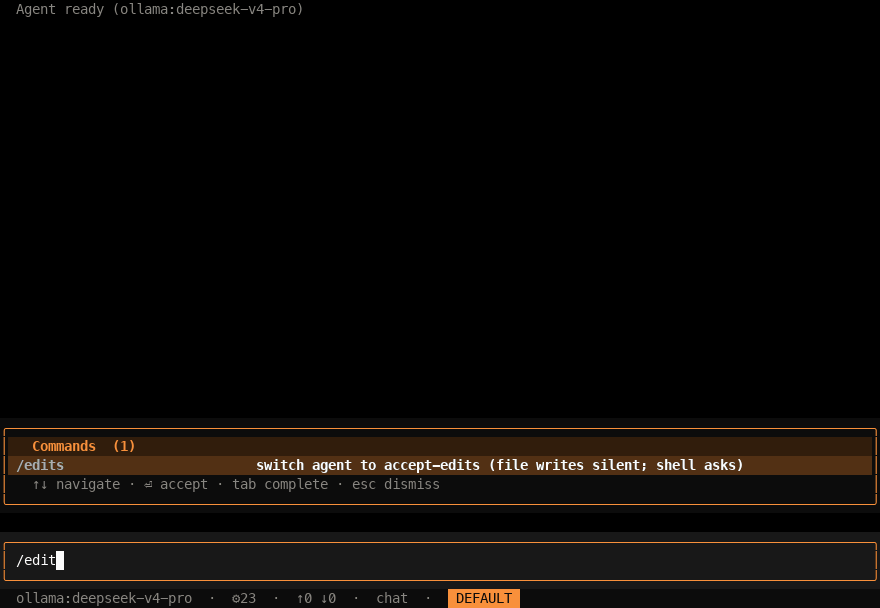

# coding_agent

Coding agent built on deepagent SDK. **Working.**

**Goal:** a coding agent that can solve **long-horizon tasks** — multi-file refactors, end-to-end feature work, debugging that spans the codebase.

**Inspiration:** Anthropic's **Pi** and Sourcegraph's **Amp**.

## Demo

  

> `koda --agent coding_agent --model ollama:deepseek-v4-pro` — todo-list planning,
> silent file writes in accept-edits mode, and the permission gate for shell commands.

## TODO

- [x] Agent integrated, tools added
- [x] Loop (the agent is missing an outer control loop
- [x] Proactive action for the prompt
- [x] Human-in-the-loop
- [x] Plan mode
- [x] Edit mode
- [x] Auto-fly mode (accept all changes)
- [ ] Code execution Docker environment
- [ ] Mature the compaction
- [ ] Mature the subagent
- [ ] Optimize tool calling (RLM)
